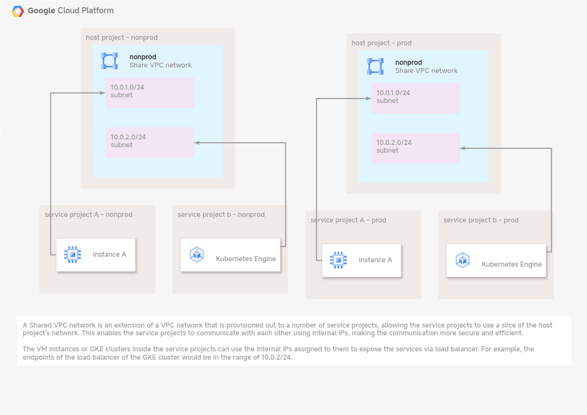
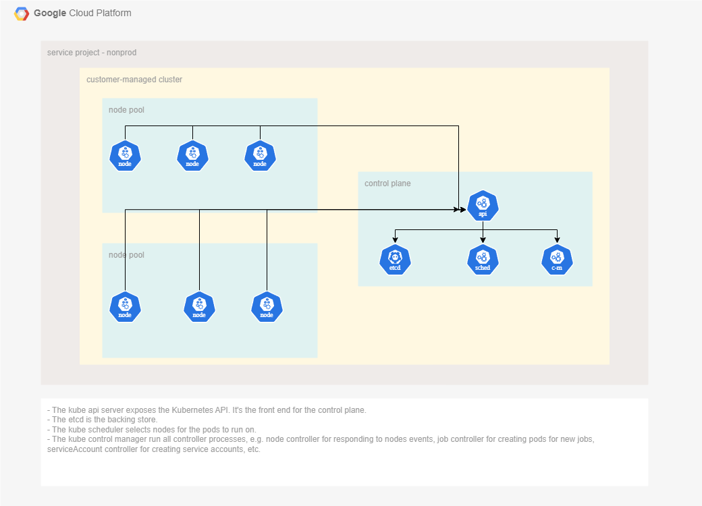

# cloud-concepts

## networking topics
- shared vpc

- serverless vpc
- vpc service control
- vpc network peering

## GKE
- Kubernetes components

- private gke network 
  - cluster pod ip, service ip
  - control plane ip
  - subnet ip 
  - firewall (target at node)
  - service networking
- service mesh with Istio