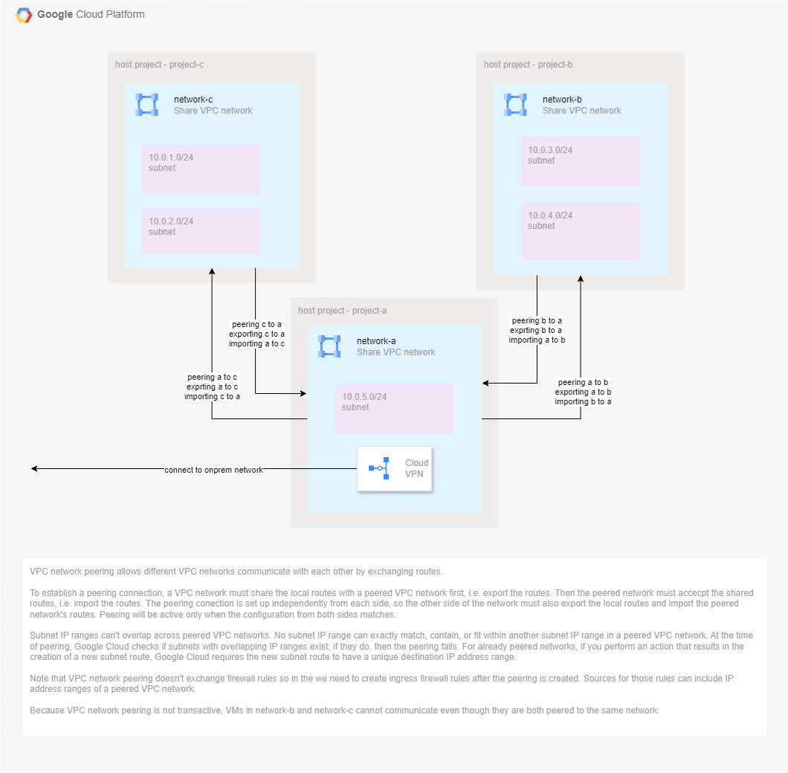
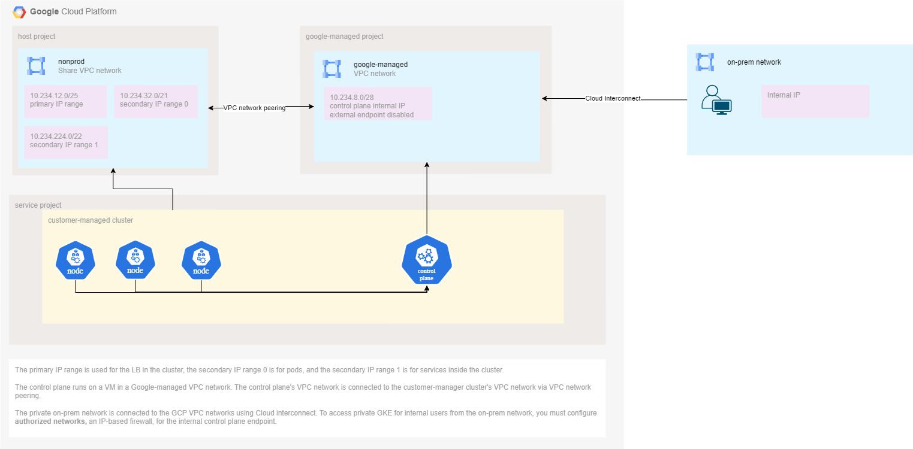

# cloud-concepts

## networking topics
- shared vpc

- private services access
- vpc network peering

  - firewall (target at node)
- serverless vpc
- vpc service control

## GKE
- Kubernetes components

- private gke network 

quoted from https://cloud.google.com/kubernetes-engine/docs/concepts/private-cluster-concept#the_control_plane_in_private_clusters

Traffic between nodes and the control plane is routed entirely using internal IP addresses. If you use VPC Network Peering to connect your cluster's VPC network to a third network, the third network cannot reach resources in the control plane's VPC network. This is because VPC Network Peering only supports communication between directly peered networks, and the third network cannot be peered with the control plane network.

- service mesh with Istio
  - service networking